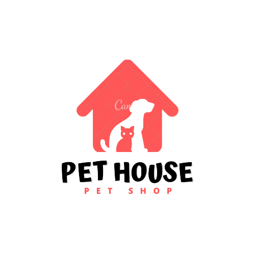

  

<b>Projeto APIs REST em NodeJS (ESTUDOS)</b>

<space> <space>
<space><space> 

  <h1 align="center">API - Petshop</h1>
  <h3 align="center"></h3>
  
Nesta parte da formação, você vai avançar no entendimento do funcionamento do JavaScript como linguagem de back-end, desenvolvendo e aprofundando seu conhecimento em APIs REST com Node.js. Além de aprender boas práticas como padronização e versionamento de APIs..

  
## **Overview**

### O que você aprenderá
  * Crie uma aplicação do zero seguindo a convenção REST

  * Mapeamento objeto-relacional com JPA
  * Aprenda a arquitetar APIs escaláveis
  * Entenda como requisições HTTP funcionam
  * Conheça os componentes de uma requisição como cabeçalhos e status
  * Saiba como melhorar a comunicação entre aplicações
  * Aprenda a versionar recursos e rotas na sua API
  * Conheça as melhores práticas do mercado em APIs RESTful
  * Descubra como adicionar camadas de segurança à sua aplicação
  * Saiba como auto documentar sua API RESTful
  * Implantação do backend no Heroku
  * Aprenda como trabalhar com hierarquia de dados em sua API RESTful
  
### Há algum requisito ou pré-requisito para o curso?
  * Computador Mac, Linux ou Windows
  * Conhecimento básico de operação do sistema operacional: instalação / descompactação / terminal
  * Conhecimento básico de Programação Orientada a Objetos em alguma linguagem moderna (Java, C#, Python, PHP, etc.): classes, atributos, métodos, construtores, encapsulamento, elementos estáticos.
  * Conhecimento básico de HTML, CSS e JavaScript
  * Conhecimento básico de banco de dados relacionais (o curso apresenta um breve nivelamento sobre este tema)

  *     "body-parser": "^1.19.0"
        "config": "^3.3.6"
        "cors": "^2.8.5"
        "express": "^4.17.1"
        "jsontoxml": "^1.0.1"
        "mysql2": "^2.3.3"
        "sequelize": "^6.12.0-alpha.1"

### Para quem é este curso:
  * Estudantes de cursos de computação e desenvolvimento de sistemas
  * Profissionais que desejam adquirir conhecimento nas técnicas e ferramentas propostas no curso
  * Entusiastas e empreendedores que desejam criar aplicativos e sistemas
